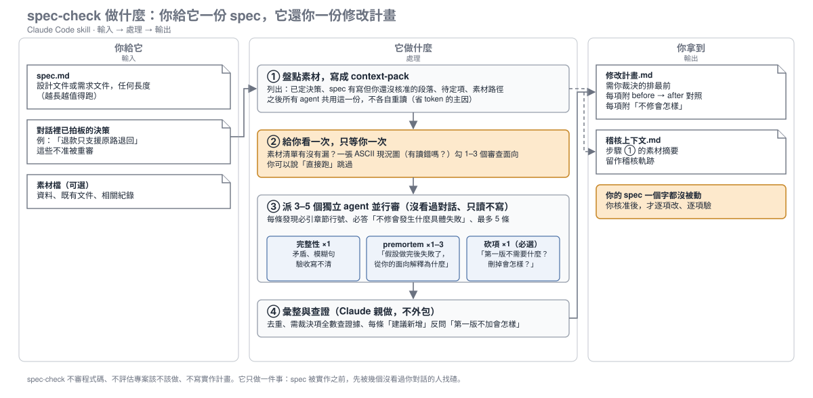

# spec-check

[English](README.en.md) · 繁體中文

 

首次上傳 2026-09-15 · 最後同步 2026-09-15

**spec 定稿前，先讓幾個獨立的 AI agent 分頭找碴，最後由你裁決——產出是一份「修改計畫」，不是直接改你的 spec。**

## 什麼是 skill？

Claude Code 的 skill 就是一個資料夾，裡面有一份 `SKILL.md`，告訴 Claude「什麼情境要用、用的時候照什麼步驟」。
放進 `~/.claude/skills/` 之後，Claude 會在符合描述的情境自動載入它，你也可以打 `/spec-check` 手動叫它。
本 repo 就是這樣一個資料夾——clone 下來就能用，不需要安裝其他東西。

## 一張圖看懂



三條泳道：**你**只在兩個點出現（確認素材、最後裁決）；**指揮官**（你正在對話的 Claude）負責盤點、派工、彙整；**agents** 是臨時派出去的獨立審查員，只能讀不能寫。

## 它解決什麼問題

**情境一：你寫好一份 spec，請 AI「幫我看看」。**
AI 回你 11 條建議，全部都是「建議補上 X」「建議增加 Y」——零砍項。你照單全收，spec 從 200 行變 350 行，實作時才發現一半是過度設計。
（這不是假設，是這個 skill 誕生前的實測 baseline。）

**情境二：你和 AI 討論了一小時，拍板了三個決策，然後請它審 spec。**
審查結果第一條：「建議重新考慮決策 A」。你剛才才決定的。
更糟的是：spec 裡有一段是 AI 自己加的、你還沒點頭，審查時它被當成已定事實跳過了。

spec-check 針對這兩種失敗各放了一道硬性約束：**必選「砍項」面向**、**每條建議必答「不修會發生什麼具體失敗」**、**已定決策不得重審**、**未核准段落要單獨列出**。

## 為什麼不能用 X 取代

| 替代做法 | 它做的事 | spec-check 多做的事 | 少了會怎樣 |
|---|---|---|---|
| 直接問 AI「幫我看這份 spec」 | 回一串建議 | 必選砍項面向；每條答「不修會怎樣」；已定決策不重審；產修改計畫、不改 spec | 建議全是加項；剛拍板的決策被重啟；spec 被直接改動、沒有裁決軌跡 |
| superpowers `brainstorming` 的 Spec Self-Review | 作者自己檢查 4 項、當場修 | 用**沒看過對話**的 fresh-context agents 審；多面向 premortem（「假設做完後專案失敗了，為什麼？」）；指揮官抽驗證據；裁決留給人 | 自己寫的 spec 看不到自己的盲點；沒有「做完後為何失敗」的情境推演 |
| superpowers `writing-plans` 的自審／`requesting-code-review` | 驗 plan 有沒有覆蓋 spec／審程式碼 diff | 質疑 **spec 本身**對不對 | 錯的 spec 被忠實地實作出來 |

一句話：其他工具審的是「有沒有照 spec 做」，spec-check 審的是「spec 該不該這樣寫」。

## 安裝

目錄名必須是 `spec-check`（和 `SKILL.md` 裡的 `name` 一致），否則 Claude 找不到。

**Claude Code（全域，所有專案都能用）**

```bash
git clone https://github.com/wuchengwei1996/claude-skill-spec-check.git ~/.claude/skills/spec-check
```

**Claude Code（只在某個專案用）**

```bash
git clone https://github.com/wuchengwei1996/claude-skill-spec-check.git .claude/skills/spec-check
```

**Codex CLI**

```bash
git clone https://github.com/wuchengwei1996/claude-skill-spec-check.git ~/.codex/skills/spec-check
```

**確認裝好了**：在 Claude Code 裡打 `/`，選單出現 `spec-check` 就成功；或直接說「檢查這份 spec」看它有沒有接手。

**更新**：`cd ~/.claude/skills/spec-check && git pull`

## 怎麼觸發

說這些話都會觸發：「檢查這份 spec」「spec 體檢」「驗一下 spec」「對 spec 做 premortem」，或直接打 `/spec-check`。

一段典型對話長這樣：

> **你**：/spec-check docs/specs/退款流程-design.md
>
> **Claude**：讀完了。素材我盤點到這些（列出清單）……
> 現況我畫成這張（一張 ASCII 流程圖）——有讀錯嗎？
> 這份 spec 偏流程類，建議勾「使用情境」＋「資料與整合」兩個面向，外加必選的「砍項」。有沒有我漏掉的資料？
>
> **你**：沒漏，直接跑。
>
> **Claude**：（派出 3 個 agents，各自讀 context-pack（步驟 1 產的素材摘要檔）與 spec，幾分鐘後回報）
> 彙整完了，修改計畫已落檔 `docs/specs/2026-09-15-退款流程-design-修改計畫.md`。
> 需要你裁決的有 2 項（排最前）：
> 🔴 §3.2「退款逾七天自動核准」與 §5 驗收條件矛盾——不修的話，實作者會二選一，測試永遠有一邊紅。before → after 對照在計畫裡。
> 🔴 砍項：§6 的「多幣別退款」第一版沒有任何使用情境用到——不砍的話多 3 張表、2 條 API，全部沒人叫。
> 建議修的 🟡 有 3 項，備註 🟢 有 1 項。核准後我再逐項改 spec。

注意最後一句：**它不會自己動手改 spec**，要等你點頭。

## 內部流程（對應總圖）

1. **素材盤點 → context-pack**：讀 spec，盤出「已定決策」「spec 有寫但你還沒核准的段落」「待定項」「素材路徑」，落成一份 `稽核上下文.md`。這份檔是給 agents 共用的預消化，讓 3–5 個 agents 不用各自重讀所有素材（實測單一 agent 自己重讀一輪約 10 萬 token，共用是主要省錢點）。
2. **單一確認點**：一則訊息給齊三件事——素材清單、一張 ASCII 現況圖、面向選單——只等你一次。現況圖的目的是讓你 10 秒內看出「Claude 有沒有讀錯 spec」，讀錯就會派錯工。你可以說「直接跑」跳過。
3. **並行派工**：完整性審查 ×1（找矛盾、模糊句、驗收盲區）、premortem 各面向 ×1–3（「假設照這份 spec 做完後專案失敗了，從你的面向解釋為什麼」）、砍項 ×1 必選（「第一版不需要什麼？刪掉會怎樣？」）。每個 agent 都拿到同一份 context-pack，只讀不寫，每條 finding 必引章節行號、最多 5 條。交辦範本在 `SKILL.md` 附錄 A。
4. **彙整裁決**：指揮官親做、不外包——併排去重，🔴 級全數查證據、🟡🟢 至少抽一條，每條「建議新增」逐條問「第一版不加會怎樣」。
5. **修改計畫落檔**：`YYYY-MM-DD-<spec名>-修改計畫.md`，🔴 需你裁決的排最前，每項附 before → after 同框對照。格式在 `SKILL.md` 附錄 B。

## 可選整合

- **superpowers**：spec-check 設計上接在 `brainstorming`（寫 spec）之後、`writing-plans`（產 plan）之前，但不依賴它們——單獨裝也能用。
- **模型路由**：`SKILL.md` 建議完整性審查用 opus、其餘用 sonnet；這只是建議，改成你環境有的模型即可。

## 自訂

- **面向選單**：`SKILL.md` 步驟 2 的【技術可行性／使用情境／前端／後端／資料與整合／維運／成本時程】可依你的領域增刪。
- **agents 數量**：步驟 3 的規模判斷（spec < 200 行 → 3 個 agents）可調。
- **修改計畫格式**：附錄 B 是我的文件慣例（人類層在上、機器層在下、😣/🎯 開頭），換成你的慣例也行。

## FAQ

**它會改我的 spec 嗎？**
不會。產出是修改計畫，你核准後才逐項改，改完還會 read-back 驗證。

**沒裝 superpowers 也能用嗎？**
能。它只在 description 提到 superpowers 是為了說明「產 plan 不是它的事」。

**為什麼要先落 context-pack，直接派 agents 不行嗎？**
兩個原因：省 token（agents 共用預消化，不各自重讀），以及防止重審已定決策（context-pack 明列「已定」清單，agents 不得推翻）。

**spec 很短也要跑嗎？**
幾十行的 spec 通常 3 個 agents 就夠（完整性＋砍項＋1 個面向）。再短的話，直接請 Claude 看可能更快——這個 skill 的價值在 spec 大到「一個人讀不完整」的時候。

**agents 用什麼模型？一定要 opus 嗎？**
不一定。附錄 A 的範本不綁模型；opus/sonnet 只是作者環境的建議路由。

## 系列

同作者的另外兩個 skill：

- [claude-skill-explain](https://github.com/wuchengwei1996/claude-skill-explain)：先找理解斷點，再選說明方法——不是換句話說。
- [claude-skill-show](https://github.com/wuchengwei1996/claude-skill-show)：先讀懂資訊，再決定怎麼畫，然後真的做出來並回讀驗收。

## License

MIT
